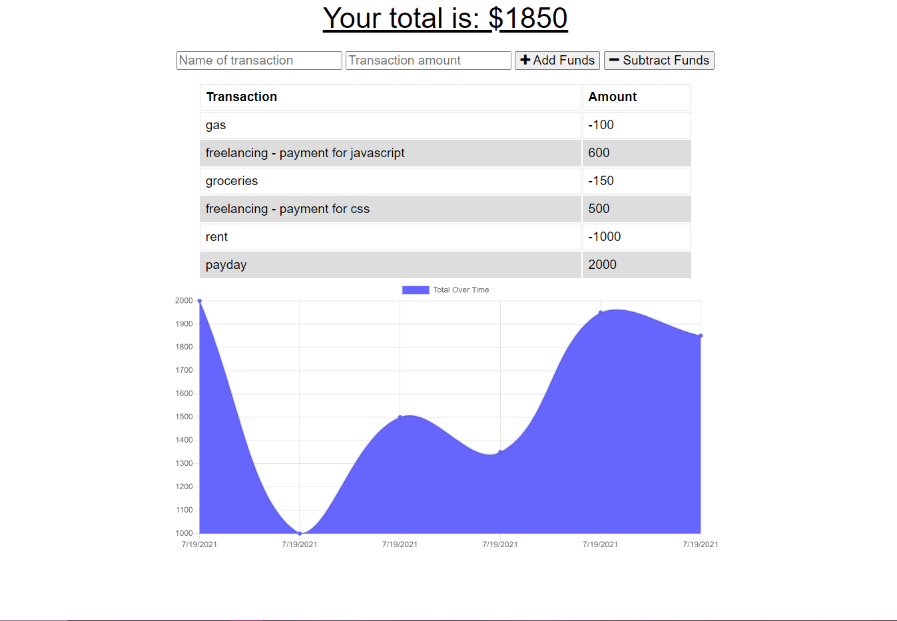

  # Progressive Budget App

  ## Table of Contents
  - [Description](#description)
  - [Installation Instructions](#installation-instructions)
  - [Usage Information](#usage-information)
  - [Questions?](#questions)

  ## Description
  This is a progressive web application that allows you to track transactions on or offline. Your transactions are stored to a MongoDB database, which is updated each time a new transaction is entered.
  ## Installation Instructions
  From GitHub: Download the repository and make sure MongoDb and all required Node modules are installed. Start the application and navigate to the localhost page to use the app. From Heroku: Visit the app page at https://sleepy-everglades-32339.herokuapp.com/.
  ## Usage Information
  From Github: Run "npm start" or "node server.js" to boot up the app. Navigate to your localhost port to use the app. From Heroku: Visit the app page at https://sleepy-everglades-32339.herokuapp.com/.
  
 

  ## Questions?
Find me on GitHub at gleeson-emily.